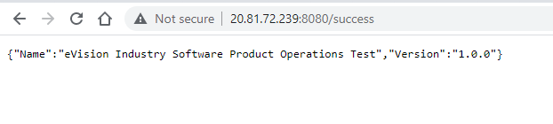
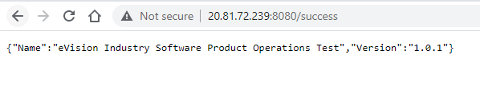

# Versions

   ```
    TF - 0.12.31
    AKS - 1.20.9
   ```

# Type of Resources

  - Docker
  - Terraform 
  - Azure Container Registry
  - Azure Kubernetes Service
  - Storage Account - Blob Container
  - Create Deployment on Kubernetes to host various version of application

# Dockerizing the application and pushing it to ACR private repository.

   ```
   FROM alpine:3.14
   COPY /bin/ /app
   WORKDIR /app
   EXPOSE 8080
   ENTRYPOINT ["./eVision-product-ops.linux.1.0.0"]
   ```
  
  - Second Version of Application
   
    ```
    FROM alpine:3.14
    COPY /bin/ /app
    WORKDIR /app
    EXPOSE 8080
    ENTRYPOINT ["./eVision-product-ops.linux.1.0.1"]
    ```

   - Tagging this image with **`v1`** and **`v2`** versions.

# Terraform Code to create repeatable Infra

  - This repository contains the required terraform files to provision the infrastructure.
  - It will create an AKS cluster.
  - ACR Registry.
  - Storage Account.


# Azure Container Registry

   - Pushing both Docker image to private container repository Azure Container Registory in this case.
   - ACR **`enablon.azurecr.io`**

#  Deployment

   - Below is the deployment file that needs to be created with >1 replicas to serve traffic and applications availability
   - Secoud resource is to expose the deployment as a service with type Load Balancer IP which gets the Public IP where the application will be accessible.
   - Once the service get the public ip try to access it over the **`http://<public_ip>:8080/success`** that will return as below

   

    ```
    apiVersion: apps/v1
    kind: Deployment
    metadata:
      creationTimestamp: null
      labels:
        app: wk
      name: wk
    spec:
      replicas: 3
      selector:
        matchLabels:
          app: wk
      strategy: {}
      template:
        metadata:
          creationTimestamp: null
          labels:
            app: wk
        spec:
          containers:
          - image: enablon.azurecr.io/v1:v1
            imagePullPolicy: Always
            name: v1
            resources: {}
    status: {}     
    ```

    ```
    apiVersion: v1
    kind: Service
    metadata:
      creationTimestamp: null
      labels:
        app: wk
      name: wk
    spec:
      ports:
      - port: 8080
        protocol: TCP
        targetPort: 8080
      selector:
        app: wk
      type: LoadBalancer
    status:
      loadBalancer: {}
    ```

   - Once the deployment of first version is done successfully use below command to release the new feature/version of the image.

     ```
      kubectl set image deployment wk v1=enablon.azurecr.io/v2:v2
     ```

   - Verify the deployment **`http://<public_ip>:8080/success`** that will return as below

     


# Storage Backend

  - As a best practice we are storing the **`tfstate`** file in the storage account named **`tfstateacme`** under blob container **`tfstate`**
